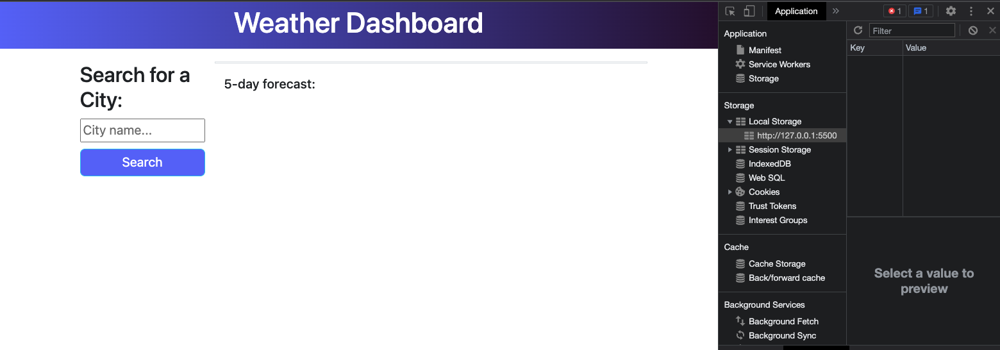
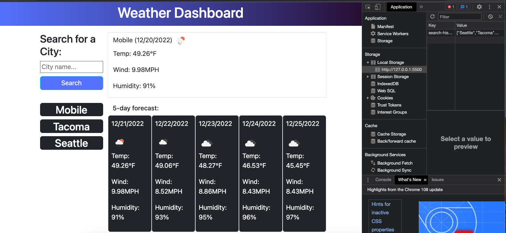
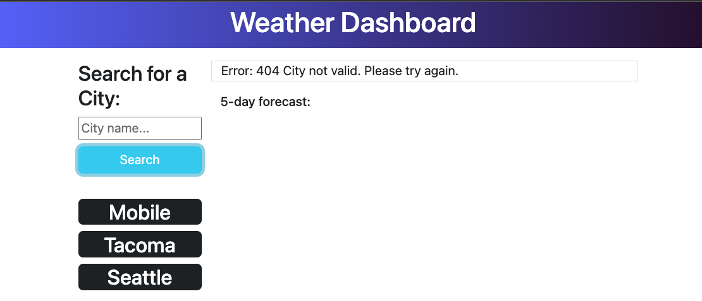

# Weather-Dashboard
This repo features an app that hosts a 5 day weather forecast on any location you select.

## Description

From heading to work or heading to visit friends and family, everyone goes outside at some point. When we do the weather can be a huge deciding factor of how we dress. Therefore, knowing the weather in advance can allow us to prepare for what's ahead. I created this project as a way to help others know what the weather will be like so they can plan accordingly. Users will be abe to input a city of their choosing and the app will use an api to call data on the weather of that city. Users will also be able to view past cities they have searched through clickable history links dynamically added to the page. They will see both current weather and a 5 day weather forecast. In creating this project, I had a difficult time parsing through the data. However, that allowed me to deepen my understanding of how to read and call data from API's.  

## Table of Contents

If your README is long, add a table of contents to make it easy for users to find what they need.

- [Installation](#installation)
- [Usage](#usage)
- [Credits](#credits)
- [License](#license)
- [Features](#features)
- [Tests](#tests)

## Installation

No installation needed. The live page will run and allow for password generation.

## Usage

https://jerrybeau89.github.io/weather-dashboard/

## Credits

Credit for HTML and CSS goes to Bootstrap. 2022

## License

MIT License

Copyright (c) 2022 Jerry Beau Baggett

Permission is hereby granted, free of charge, to any person obtaining a copy
of this software and associated documentation files (the "Software"), to deal
in the Software without restriction, including without limitation the rights
to use, copy, modify, merge, publish, distribute, sublicense, and/or sell
copies of the Software, and to permit persons to whom the Software is
furnished to do so, subject to the following conditions:

The above copyright notice and this permission notice shall be included in all
copies or substantial portions of the Software.

THE SOFTWARE IS PROVIDED "AS IS", WITHOUT WARRANTY OF ANY KIND, EXPRESS OR
IMPLIED, INCLUDING BUT NOT LIMITED TO THE WARRANTIES OF MERCHANTABILITY,
FITNESS FOR A PARTICULAR PURPOSE AND NONINFRINGEMENT. IN NO EVENT SHALL THE
AUTHORS OR COPYRIGHT HOLDERS BE LIABLE FOR ANY CLAIM, DAMAGES OR OTHER
LIABILITY, WHETHER IN AN ACTION OF CONTRACT, TORT OR OTHERWISE, ARISING FROM,
OUT OF OR IN CONNECTION WITH THE SOFTWARE OR THE USE OR OTHER DEALINGS IN THE
SOFTWARE.

## Features

This project has the following features: Search for a city and obtain the current weather, and the 5 day weather forecast. Additionally, you will be able to store cities you have searched for in local storage, display them on the screen and click them to return to the weather data regarding said city. 

## Tests

Want to test of the project? Try the following: 

- Search a known city
- Search a random word and see and Error
- Select a past city from the previously searched cities
- Refresh your page and see the previous cities remain and are clickable. 